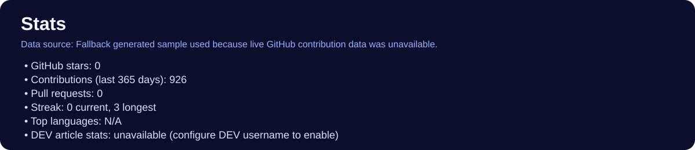
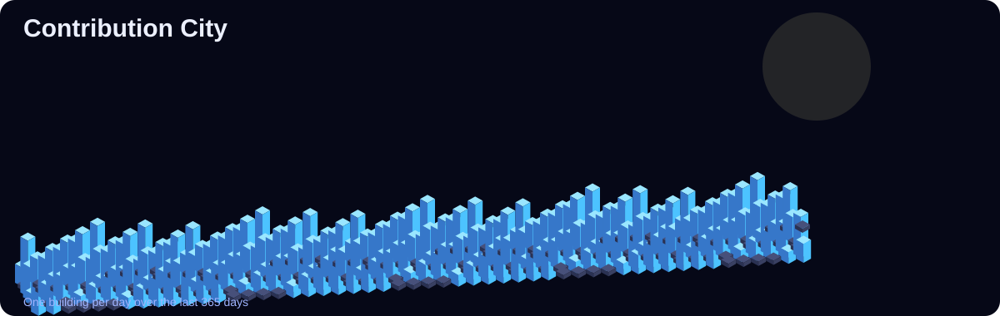
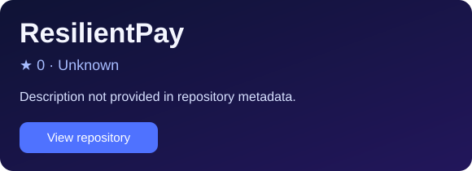
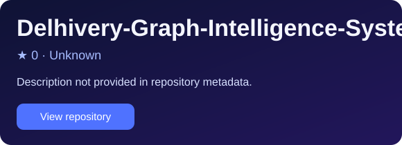
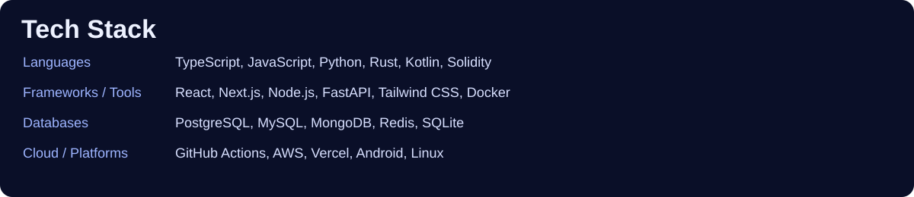

<p align="center">


<a href="https://dev.to/your-dev-username"></a><a href="https://www.linkedin.com/in/your-linkedin"></a><a href="https://x.com/your-x-handle"></a><a href="https://www.youtube.com/@your-channel"></a><a href="https://discord.com/users/your-user-id"></a>



<a href="https://github.com/Shikhyy/wyrmline"></a>
<a href="https://github.com/Shikhyy/Nexus"></a>
<a href="https://github.com/Shikhyy/EcoTrack"></a>
<a href="https://github.com/Shikhyy/ResilientPay"></a>
<a href="https://github.com/Shikhyy/accomplish"></a>
<a href="https://github.com/Shikhyy/AEOspy"></a>
<a href="https://github.com/Shikhyy/AI_Parliament"></a>
<a href="https://github.com/Shikhyy/Agentarena"></a>
<a href="https://github.com/Shikhyy/VitaSync"></a>
<a href="https://github.com/Shikhyy/Delhivery-Graph-Intelligence-System"></a>



</p>

## Project Catalog

All currently visible public repositories are listed below.

- [accomplish](https://github.com/Shikhyy/accomplish) — Description not provided in repository metadata.
- [AEOspy](https://github.com/Shikhyy/AEOspy) — Description not provided in repository metadata.
- [Agentarena](https://github.com/Shikhyy/Agentarena) — Description not provided in repository metadata.
- [AgentWill](https://github.com/Shikhyy/AgentWill) — Description not provided in repository metadata.
- [AgriSupply](https://github.com/Shikhyy/AgriSupply) — Description not provided in repository metadata.
- [AI_Parliament](https://github.com/Shikhyy/AI_Parliament) — Description not provided in repository metadata.
- [Apex](https://github.com/Shikhyy/Apex) — Description not provided in repository metadata.
- [BidWire](https://github.com/Shikhyy/BidWire) — Description not provided in repository metadata.
- [cairnquill](https://github.com/Shikhyy/cairnquill) — Description not provided in repository metadata.
- [Cards-Against-Humanity](https://github.com/Shikhyy/Cards-Against-Humanity) — Description not provided in repository metadata.
- [Contenthub](https://github.com/Shikhyy/Contenthub) — Description not provided in repository metadata.
- [Credo](https://github.com/Shikhyy/Credo) — Description not provided in repository metadata.
- [Decoding-Customer-Value](https://github.com/Shikhyy/Decoding-Customer-Value) — Description not provided in repository metadata.
- [Delhivery-Graph-Intelligence-System](https://github.com/Shikhyy/Delhivery-Graph-Intelligence-System) — Description not provided in repository metadata.
- [Dotsafe](https://github.com/Shikhyy/Dotsafe) — Description not provided in repository metadata.
- [EcoTrack](https://github.com/Shikhyy/EcoTrack) — Description not provided in repository metadata.
- [firstlight](https://github.com/Shikhyy/firstlight) — Description not provided in repository metadata.
- [GOSSIP](https://github.com/Shikhyy/GOSSIP) — Description not provided in repository metadata.
- [hiver-sde-assignment](https://github.com/Shikhyy/hiver-sde-assignment) — Description not provided in repository metadata.
- [LoyaltyChain](https://github.com/Shikhyy/LoyaltyChain) — Description not provided in repository metadata.
- [Nexus](https://github.com/Shikhyy/Nexus) — Description not provided in repository metadata.
- [NovaStream](https://github.com/Shikhyy/NovaStream) — Description not provided in repository metadata.
- [Pantheon](https://github.com/Shikhyy/Pantheon) — Description not provided in repository metadata.
- [Petal](https://github.com/Shikhyy/Petal) — Description not provided in repository metadata.
- [PlayStake](https://github.com/Shikhyy/PlayStake) — Description not provided in repository metadata.
- [precedent](https://github.com/Shikhyy/precedent) — Description not provided in repository metadata.
- [Pulse](https://github.com/Shikhyy/Pulse) — Description not provided in repository metadata.
- [pulsetwin](https://github.com/Shikhyy/pulsetwin) — Description not provided in repository metadata.
- [ResilientPay](https://github.com/Shikhyy/ResilientPay) — Description not provided in repository metadata.
- [resilientpay-android](https://github.com/Shikhyy/resilientpay-android) — Description not provided in repository metadata.
- [resilientpay-web](https://github.com/Shikhyy/resilientpay-web) — Description not provided in repository metadata.
- [squadrune](https://github.com/Shikhyy/squadrune) — Description not provided in repository metadata.
- [stratify](https://github.com/Shikhyy/stratify) — Description not provided in repository metadata.
- [TSA-Capstone](https://github.com/Shikhyy/TSA-Capstone) — Description not provided in repository metadata.
- [VaultGate](https://github.com/Shikhyy/VaultGate) — Description not provided in repository metadata.
- [Vision-Quest](https://github.com/Shikhyy/Vision-Quest) — Description not provided in repository metadata.
- [VitaSync](https://github.com/Shikhyy/VitaSync) — Description not provided in repository metadata.
- [VolunteerIQ](https://github.com/Shikhyy/VolunteerIQ) — Description not provided in repository metadata.
- [WakeTogether](https://github.com/Shikhyy/WakeTogether) — Description not provided in repository metadata.
- [wyrmline](https://github.com/Shikhyy/wyrmline) — Description not provided in repository metadata.
- [YoSubs](https://github.com/Shikhyy/YoSubs) — Description not provided in repository metadata.

## Configuration

- Edit `tools/profile/config.json` to set display text and social links.
- Set `dev.enabled=true` and `dev.username` to enable DEV article cards/statistics.
- For best GitHub stats and real contribution calendar data, provide `GITHUB_TOKEN` with public read access.

## Regenerate Locally

```bash
python3 tools/profile/generate.py
python3 -m unittest discover -s tests -p "test_*.py"
```

## Notes

- Contribution city is generated as an original isometric night skyline with one building per day from GitHub contribution data.
- If contribution data cannot be fetched (missing token/rate limits), a deterministic fallback skyline is rendered and labeled in stats.
- No secrets are stored in this repository; configure optional tokens via environment variables in GitHub Actions.
